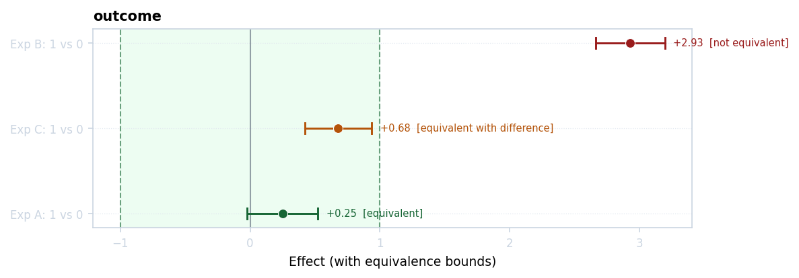
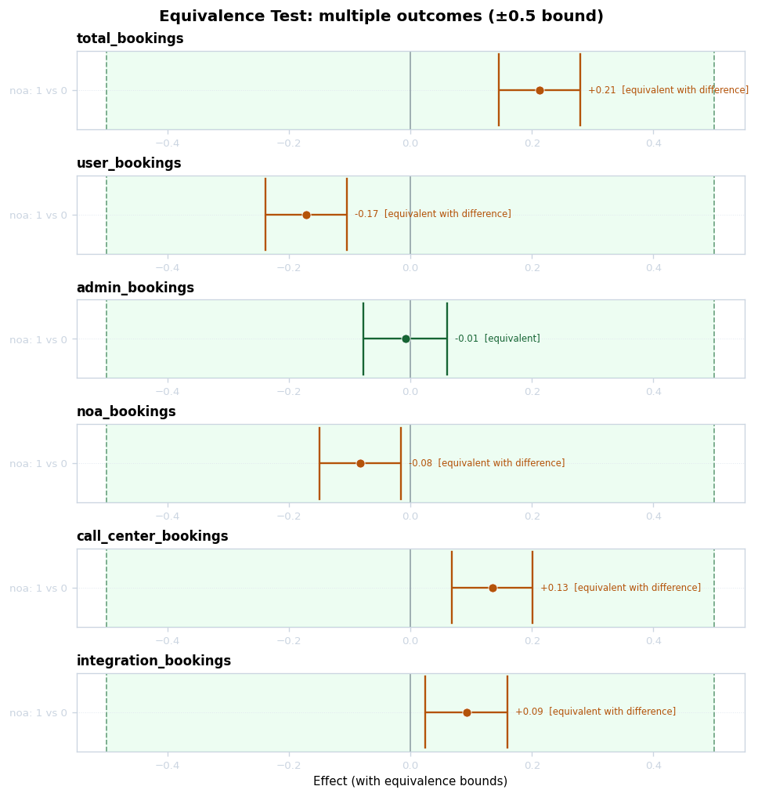
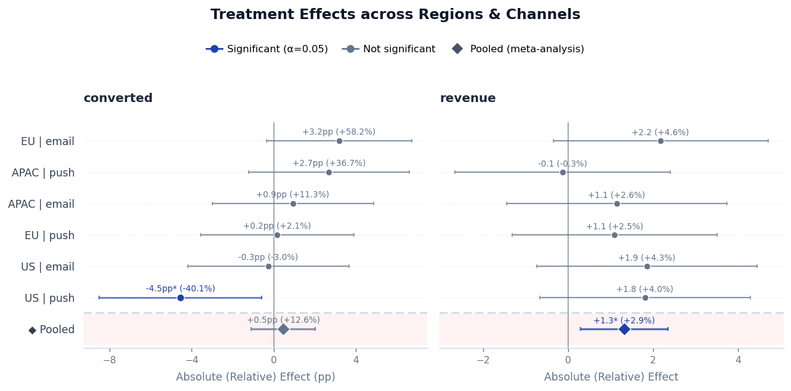
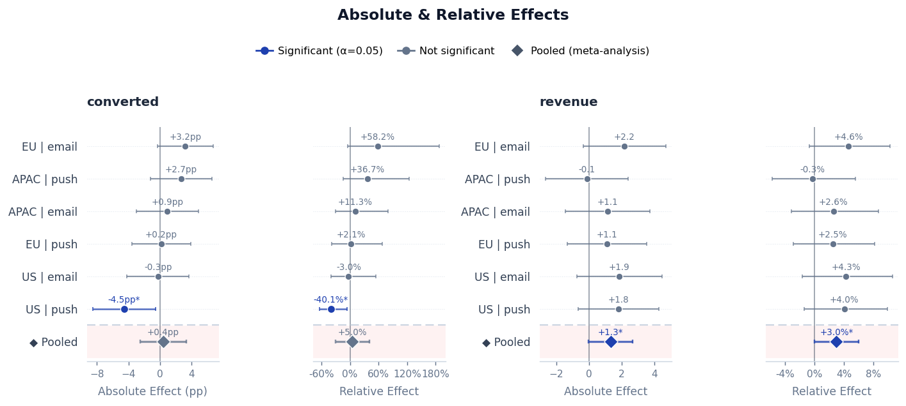
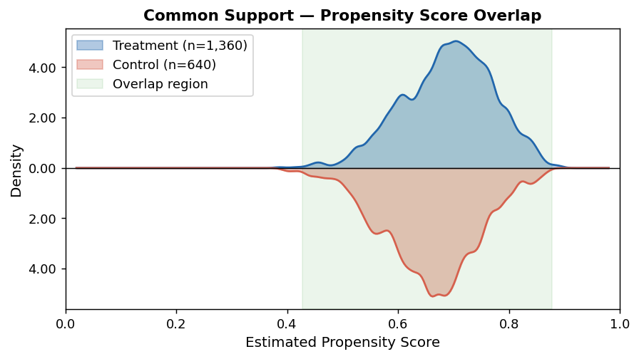

# Experiment Utils

[](https://github.com/sdaza/experiment-utils-pd/actions/workflows/ci.yaml)
[](https://github.com/sdaza/experiment-utils-pd/releases)
[](https://pypi.org/project/experiment-utils-pd/)
[](https://pypi.org/project/experiment-utils-pd/)
[](https://pepy.tech/project/experiment-utils-pd)
[](https://github.com/sdaza/experiment-utils-pd/stargazers)
[](https://github.com/sdaza/experiment-utils-pd/blob/main/LICENSE)

A comprehensive Python package for designing, analyzing, and validating experiments with advanced causal inference capabilities.

Source code: https://github.com/sdaza/experiment-utils-pd

## Features

- **Experiment Analysis**: Estimate treatment effects with multiple adjustment methods (covariate balancing, regression, IV, AIPW)
- **Multiple Outcome Models**: OLS, logistic, Poisson, negative binomial, and Cox proportional hazards
- **Doubly Robust Estimation**: Augmented IPW (AIPW) for OLS, logistic, Poisson, and negative binomial models
- **Survival Analysis**: Cox proportional hazards with IPW and regression adjustment
- **Covariate Balance**: Check and visualize balance between treatment groups
- **Marginal Effects**: Average marginal effects for GLMs (probability change, count change)
- **Overlap Weighting & Trimming**: Overlap weights (ATO) and propensity score trimming for robust handling of limited common support
- **Meta-Analysis**: Fixed-effects (IVW) and random-effects (Paule-Mandel + HKSJ) pooling across experiments, with heterogeneity diagnostics (τ², I², Cochran's Q)
- **Bootstrap Inference**: Robust confidence intervals and p-values via bootstrap resampling
- **Multiple Comparison Correction**: FWER control (Bonferroni, Holm, Hochberg, Sidak, Dunnett, Tukey HSD) and FDR control (Benjamini-Hochberg, Benjamini-Yekutieli)
- **Effect Visualization**: Cleveland dot plots of treatment effects across experiments, with auto-scaled percentage-point annotations, combined absolute/relative labels, fixed or random-effects pooling, magnitude sorting, and grouping by any experiment column
- **Overlap Diagnostics**: Mirror density plots of propensity score distributions (`plot_overlap`) with overlap coefficient annotation and group-by splitting
- **Equivalence Testing (TOST)**: Two One-Sided Tests for equivalence, non-inferiority, non-superiority, and minimum-effect (superiority by margin) following Lakens (2017, 2018), with absolute, relative, and Cohen's d bounds, Lakens' four-cell conclusion matrix, and dedicated visualization
- **Power Analysis**: Calculate statistical power and find optimal sample sizes, including TOST equivalence power
- **Retrodesign Analysis**: Assess reliability of study designs (Type S/M errors)
- **Winner's-Curse Correction**: De-bias effects selected by significance — conditional truncated-normal estimate with selection-adjusted CI (two-sided or one-sided), empirical-Bayes / Student-t / Half-Cauchy-MAP shrinkage, program-level `cumulative_impact` / NSS-adjusted cumulative, Airbnb `process_level_total_effect`, optional `joint_metric_shrinkage` with `estimate_guardrail_rho` (all in `experiment_utils.shrinkage`), plus analyzer wrappers (`winners_curse_summary`, `cumulative_impact_summary`)
- **Random Assignment**: Generate balanced treatment assignments with stratification

## Table of Contents

- [Experiment Utils](#experiment-utils)
  - [Features](#features)
  - [Table of Contents](#table-of-contents)
  - [Installation](#installation)
    - [From PyPI (Recommended)](#from-pypi-recommended)
    - [From GitHub (Latest Development Version)](#from-github-latest-development-version)
  - [Quick Start](#quick-start)
  - [User Guide](#user-guide)
    - [Basic Experiment Analysis](#basic-experiment-analysis)
    - [Covariate Parameters](#covariate-parameters)
    - [Checking Covariate Balance](#checking-covariate-balance)
    - [Covariate Adjustment Methods](#covariate-adjustment-methods)
    - [Outcome Models](#outcome-models)
    - [Ratio Metrics (Delta Method)](#ratio-metrics-delta-method)
    - [Survival Analysis (Cox Models)](#survival-analysis-cox-models)
    - [Bootstrap Inference](#bootstrap-inference)
    - [Multiple Experiments](#multiple-experiments)
    - [Categorical Treatment Variables](#categorical-treatment-variables)
    - [Instrumental Variables (IV)](#instrumental-variables-iv)
    - [Multiple Comparison Adjustments](#multiple-comparison-adjustments)
    - [Equivalence Testing (TOST)](#equivalence-testing-tost)
    - [Combining Effects (Meta-Analysis)](#combining-effects-meta-analysis)
    - [Visualizing Effects](#visualizing-effects)
    - [Common Support / Propensity Score Overlap](#common-support--propensity-score-overlap)
    - [Retrodesign Analysis](#retrodesign-analysis)
    - [Winner's-Curse Correction](#winners-curse-correction)
  - [Power Analysis](#power-analysis)
    - [Calculate Power](#calculate-power)
    - [Power from Real Data](#power-from-real-data)
    - [Grid Power Simulation](#grid-power-simulation)
    - [Find Sample Size](#find-sample-size)
    - [TOST Equivalence Power](#tost-equivalence-power)
    - [Simulate Retrodesign](#simulate-retrodesign)
  - [Utilities](#utilities)
    - [Balanced Random Assignment](#balanced-random-assignment)
    - [Standalone Balance Checker](#standalone-balance-checker)
  - [Advanced Topics](#advanced-topics)
    - [When to Use Different Adjustment Methods](#when-to-use-different-adjustment-methods)
    - [Non-Collapsibility of Hazard and Odds Ratios](#non-collapsibility-of-hazard-and-odds-ratios)
    - [Handling Missing Data](#handling-missing-data)
    - [Best Practices](#best-practices)
    - [Common Workflows](#common-workflows)
  - [Contributing](#contributing)
  - [License](#license)
  - [Citation](#citation)

## Installation

### From PyPI (Recommended)

```bash
pip install experiment-utils-pd
```

### From GitHub (Latest Development Version)

```bash
pip install git+https://github.com/sdaza/experiment-utils-pd.git
```

## Quick Start

All main classes and standalone functions are available directly from the package:

```python
from experiment_utils import ExperimentAnalyzer, PowerSim
from experiment_utils import balanced_random_assignment, check_covariate_balance
from experiment_utils import plot_effects, plot_equivalence, plot_overlap, plot_power
from experiment_utils.shrinkage import (  # portfolio / winner's-curse helpers
    winners_curse_estimate,
    empirical_bayes_shrinkage,
    cumulative_impact,
)
```

Here's a complete example analyzing an A/B test with covariate adjustment:

```python
import pandas as pd
import numpy as np
from experiment_utils import ExperimentAnalyzer

# Create sample experiment data
np.random.seed(42)
df = pd.DataFrame({
    "user_id": range(1000),
    "treatment": np.random.choice([0, 1], 1000),
    "conversion": np.random.binomial(1, 0.15, 1000),
    "revenue": np.random.normal(50, 20, 1000),
    "age": np.random.normal(35, 10, 1000),
    "is_member": np.random.choice([0, 1], 1000),
})

# Initialize analyzer
analyzer = ExperimentAnalyzer(
    data=df,
    treatment_col="treatment",
    outcomes=["conversion", "revenue"],
    balance_covariates=["age", "is_member"],  # balance checking
    adjustment="balance",
    balance_method="ps-logistic",
)

# Estimate treatment effects
analyzer.get_effects()

# View results
results = analyzer.results
print(results[["outcome", "absolute_effect", "relative_effect", 
               "pvalue", "stat_significance"]])

# Balance is automatically calculated when covariates are provided
balance = analyzer.balance
print(f"\nBalance: {balance['balance_flag'].mean():.1%} of covariates balanced")
```

Output:
```
       outcome  absolute_effect  relative_effect   pvalue stat_significance
0   conversion           0.0234           0.1623   0.0456                 1
1      revenue           2.1450           0.0429   0.1234                 0

Balance: 100.0% of covariates balanced
```

## User Guide

### Basic Experiment Analysis

Analyze a simple A/B test without covariate adjustment:

```python
from experiment_utils import ExperimentAnalyzer

# Simple analysis (no covariates)
analyzer = ExperimentAnalyzer(
    data=df,
    treatment_col="treatment",
    outcomes=["conversion"],
)

analyzer.get_effects()
print(analyzer.results)
```

**Key columns in results:**
- `outcome`: Outcome variable name
- `absolute_effect`: Treatment effect (treatment - control mean)
- `relative_effect`: Lift (absolute_effect / control_mean)
- `standard_error`: Standard error of the effect
- `pvalue`: P-value for hypothesis test
- `stat_significance`: 1 if significant at alpha level, 0 otherwise
- `abs_effect_lower/upper`: Confidence interval bounds (absolute)
- `rel_effect_lower/upper`: Confidence interval bounds (relative)

### Covariate Parameters

Three covariate parameters control balance checking and regression adjustment. Each can be specified independently and they can overlap freely — any covariate appearing in any list is automatically included in the balance table.

| Parameter | Role | Balance checked? | In regression formula? |
|---|---|---|---|
| `balance_covariates` | Balance checking only | Yes | No |
| `regression_covariates` | Regression main effects | Yes | Yes (main effects) |
| `interaction_covariates` | CUPED / Lin interactions | Yes | Yes (`z_col + treatment:z_col`) |

```python
analyzer = ExperimentAnalyzer(
    data=df,
    treatment_col="treatment",
    outcomes=["revenue"],
    balance_covariates=["region"],           # balance table only
    regression_covariates=["age", "tenure"], # OLS main effects + balance
    interaction_covariates=["pre_revenue"],  # CUPED variance reduction + balance
)

analyzer.get_effects()

# Balance table covers all three lists
print(analyzer.balance[["covariate", "smd", "balance_flag"]])
```

> `covariates` is still accepted as a deprecated alias for `balance_covariates`.

### Checking Covariate Balance

**Balance is automatically calculated** when you provide any covariates and run `get_effects()`:

```python
analyzer = ExperimentAnalyzer(
    data=df,
    treatment_col="treatment",
    outcomes=["conversion"],
    balance_covariates=["age", "income", "region"],  # Can include categorical
)

analyzer.get_effects()

# Balance is automatically available
balance = analyzer.balance
print(balance[["covariate", "smd", "balance_flag"]])
print(f"\nBalanced: {balance['balance_flag'].mean():.1%}")

# Identify imbalanced covariates
imbalanced = balance[balance["balance_flag"] == 0]
if not imbalanced.empty:
    print(f"Imbalanced: {imbalanced['covariate'].tolist()}")
```

**Check balance independently** (optional, before running `get_effects()` or with custom parameters):

```python
# Check balance with different threshold
balance_strict = analyzer.check_balance(threshold=0.05)
```

**Balance metrics explained:**
- `smd`: Standardized Mean Difference (|SMD| < 0.1 indicates good balance)
- `balance_flag`: 1 if balanced, 0 if imbalanced
- `mean_treated/control`: Group means for the covariate

### Covariate Adjustment Methods

When treatment and control groups differ on covariates, adjust for bias:

**Option 1: Propensity Score Weighting (Recommended)**

```python
analyzer = ExperimentAnalyzer(
    data=df,
    treatment_col="treatment",
    outcomes=["conversion", "revenue"],
    balance_covariates=["age", "income", "is_member"],
    adjustment="balance",
    balance_method="ps-logistic",  # Logistic regression for propensity scores
    estimand="ATT",  # Average Treatment Effect on Treated
)

analyzer.get_effects()

# Check post-adjustment balance
print(analyzer.adjusted_balance)

# Retrieve weights for transparency
weights_df = analyzer.weights
print(weights_df.head())
```

**Available methods:**
- `ps-logistic`: Propensity score via logistic regression (fast, interpretable)
- `ps-xgboost`: Propensity score via XGBoost (flexible, non-linear)
- `entropy`: Entropy balancing (exact moment matching)

**Target estimands:**

- `ATT`: Average Treatment Effect on Treated (most common)
- `ATE`: Average Treatment Effect (entire population)
- `ATC`: Average Treatment Effect on Control
- `ATO`: Average Treatment Effect for the Overlap population (overlap weights — see below)

**Option 2: Regression Adjustment**

```python
analyzer = ExperimentAnalyzer(
    data=df,
    treatment_col="treatment",
    outcomes=["conversion"],
    regression_covariates=["age", "income"],
    adjustment=None,  # No weighting, just regression
)

analyzer.get_effects()
```

**Option 3: CUPED / Interaction Adjustment**

Add pre-experiment metrics as treatment interactions (Lin 2013 estimator). Each covariate is standardized and entered as `z_col + treatment:z_col`. This reduces variance without changing the point estimate interpretation:

```python
analyzer = ExperimentAnalyzer(
    data=df,
    treatment_col="treatment",
    outcomes=["revenue"],
    interaction_covariates=["pre_revenue", "pre_orders"],
)

analyzer.get_effects()
# adjustment column in results will show "regression+interactions"
```

**Comparing precision across adjustment strategies**

When an analysis uses regression covariates, interaction covariates, or an
adjustment method such as IPW, the analyzer automatically computes a separate
`precision_summary`. This keeps `analyzer.results` focused on effect estimates,
while `analyzer.precision_summary` shows how the adjusted estimate compares with
an unadjusted no-covariate reference on standard errors, confidence interval
width, and point estimates. See
[`examples/precision_comparison_simple.py`](examples/precision_comparison_simple.py)
for a minimal runnable example, or
[`examples/precision_comparison.py`](examples/precision_comparison.py) for a
bootstrap version.

```python
analyzer = ExperimentAnalyzer(
    data=df,
    treatment_col="treatment",
    outcomes=["revenue"],
    regression_covariates=["age", "tenure", "pre_revenue"],
)

analyzer.get_effects()
print(analyzer.precision_summary)
```

Use `compare_precision=False` to disable the extra diagnostic computation.

For bootstrap inference, the comparison is bootstrap-to-bootstrap: the unadjusted
reference is bootstrapped on the same resamples as the adjusted model.

```python
analyzer = ExperimentAnalyzer(
    data=df,
    treatment_col="treatment",
    outcomes=["revenue"],
    regression_covariates=["age", "tenure", "pre_revenue"],
    bootstrap=True,
    bootstrap_iterations=1000,
    bootstrap_seed=42,
)

analyzer.get_effects()
print(analyzer.precision_summary)
```

Common precision columns:

| Column | Meaning |
|---|---|
| `standard_error` | SE from the requested adjusted model |
| `unadjusted_standard_error` | SE from the no-covariate reference model |
| `standard_error_ratio` | `standard_error / unadjusted_standard_error` |
| `standard_error_reduction` | `1 - standard_error_ratio`; positive means adjustment reduced SE |
| `precision` | `1 / standard_error^2` |
| `unadjusted_precision` | `1 / unadjusted_standard_error^2` |
| `precision_gain` | `precision / unadjusted_precision - 1`; positive means more precision |
| `ci_width_reduction` | Proportional CI-width reduction vs the unadjusted reference |
| `absolute_effect_change` | Adjusted effect minus unadjusted effect |

Example summary columns:

```python
print(
    analyzer.precision_summary[
        [
            "outcome",
            "adjustment",
            "absolute_effect",
            "unadjusted_absolute_effect",
            "standard_error",
            "unadjusted_standard_error",
            "standard_error_reduction",
            "precision_gain",
        ]
    ]
)
```

**Option 4: IPW + Regression (Combined)**

Use both propensity score weighting and regression covariates for extra robustness:

```python
analyzer = ExperimentAnalyzer(
    data=df,
    treatment_col="treatment",
    outcomes=["conversion", "revenue"],
    balance_covariates=["age", "income", "is_member"],
    adjustment="balance",
    regression_covariates=["age", "income"],
    estimand="ATE",
)

analyzer.get_effects()
```

For balance/IPW runs, `precision_summary` also includes effective sample size
columns when available, so you can see whether better balance came with a loss
of effective sample size:

```python
print(
    analyzer.precision_summary[
        [
            "outcome",
            "adjustment",
            "method",
            "balance",
            "standard_error_reduction",
            "precision_gain",
            "ess_treatment",
            "ess_control",
        ]
    ]
)
```

**Option 5: Doubly Robust / AIPW**

Augmented Inverse Probability Weighting is consistent if either the propensity score model or the outcome model is correctly specified. Available for OLS, logistic, Poisson, and negative binomial models:

```python
analyzer = ExperimentAnalyzer(
    data=df,
    treatment_col="treatment",
    outcomes=["revenue"],
    balance_covariates=["age", "income", "is_member"],
    adjustment="aipw",
    estimand="ATE",
)

analyzer.get_effects()

# AIPW results include influence-function based standard errors
print(analyzer.results[["outcome", "absolute_effect", "standard_error", "pvalue"]])
```

AIPW works by fitting separate outcome models for treated and control groups, predicting potential outcomes for all units, and combining them with IPW via the augmented influence function. Standard errors are derived from the influence function, making them robust without requiring bootstrap.

> **Note**: AIPW is not supported for Cox survival models due to the complexity of survival-specific doubly robust methods. For Cox models, use IPW + Regression instead.

**Option 6: Overlap Weighting (ATO)**

Overlap weights (Li, Morgan & Zaslavsky 2018) naturally downweight units with extreme propensity scores — treated units receive weight `(1 - ps)` and control units receive weight `ps`. Units near `ps = 0.5` (the region of maximum overlap) receive the highest weight. No trimming threshold is required.

```python
analyzer = ExperimentAnalyzer(
    data=df,
    treatment_col="treatment",
    outcomes=["revenue"],
    balance_covariates=["age", "income"],
    adjustment="balance",
    balance_method="ps-logistic",  # or "ps-xgboost"
    estimand="ATO",                # overlap weights
)

analyzer.get_effects()
```

> **Note**: ATO is only supported with `balance_method="ps-logistic"` or `"ps-xgboost"`. It is not compatible with `"entropy"`.

**Option 7: Propensity Score Trimming**

Trimming drops units with propensity scores outside `[trim_ps_lower, trim_ps_upper]` and recomputes weights on the remaining sample. This is useful as a robustness check when overlap is already reasonable but you want to restrict to the region where PS estimation is reliable.

```python
# Always trim to [0.1, 0.9]
analyzer = ExperimentAnalyzer(
    data=df,
    treatment_col="treatment",
    outcomes=["revenue"],
    balance_covariates=["age", "income"],
    adjustment="balance",
    trim_ps=True,
    trim_ps_lower=0.1,  # default
    trim_ps_upper=0.9,  # default
)

# Trim only when overlap is good (overlap coefficient >= threshold)
analyzer = ExperimentAnalyzer(
    ...
    trim_ps=True,
    trim_overlap_threshold=0.8,  # skip trimming if overlap < 0.8
    assess_overlap=True,
)

analyzer.get_effects()

# trimmed_units column shows how many units were dropped
print(analyzer.results[["outcome", "absolute_effect", "trimmed_units"]])
```

**Choosing between overlap weights and trimming:**

| | Overlap weights (`ATO`) | Trimming |
|---|---|---|
| Mechanism | Continuously downweights extreme-PS units | Drops units outside threshold |
| Threshold required | No | Yes (`trim_ps_lower`, `trim_ps_upper`) |
| Changes `n` | No | Yes |
| Estimand | ATO (overlap population) | ATT/ATE/ATC on trimmed sample |
| When overlap is poor | Handles gracefully | May drop many units |
| Use as robustness check | Yes | Yes |

### Fixed Effects (Panel / Within-Unit Estimation)

Use `fixed_effects` to absorb unit-level (or strata-level) variation in panel and switchback designs, where the same unit appears in both treatment and control conditions across time.

**When to use:**
- Repeated-measures / panel experiments where units switch between treatment and control (e.g. switchback A/B tests on tutors, drivers, or listings).
- Designs with strong unit-level heterogeneity you want to partial out (e.g. within-tutor or within-store effects).
- Strata fixed effects to control for known grouping structure.

**New constructor parameters:**

| Parameter | Type | Default | Description |
|---|---|---|---|
| `fixed_effects` | `list[str] \| str \| None` | `None` | Column(s) whose levels are absorbed as fixed effects |
| `fixed_effects_min_switcher_pct` | `float` | `10.0` | Warn when the share of switcher units drops below this threshold (%) |

**Switcher identification:** with unit fixed effects, only units observed in **both** treatment and control conditions ("switchers") identify the treatment effect. The results DataFrame includes three diagnostic columns:

| Column | Description |
|---|---|
| `n_units` | Total unique units in the estimation sample |
| `n_switchers` | Units observed in both treatment and control |
| `pct_switchers` | `n_switchers / n_units × 100` |
| `fe_absorbed` | Name(s) of the absorbed fixed-effect column(s) |

A warning is emitted when `pct_switchers` falls below `fixed_effects_min_switcher_pct`.

**Backend and supported models:**

Fixed effects estimation uses [pyfixest](https://github.com/py-econometrics/pyfixest) (`feols` for OLS, `fepois` for Poisson). Fixed effects are supported for `ols` and `poisson` model types combined with `adjustment=None` or `adjustment="balance"`. For `logistic`, `negative_binomial`, `cox`, or IV/AIPW estimators, a warning is issued and the analysis runs **without** fixed effects.

Variance estimation: clustered (`CRV1`) when `cluster_col` is provided; heteroskedasticity-robust (`"hetero"`) otherwise.

> **Note on relative effects under OLS fixed effects:** the intercept is absorbed, so relative effects are computed against the control-group mean of the estimation sample (a delta approximation). The Fieller-based exact relative CI does not apply in this case.

**Example:**

```python
analyzer = ExperimentAnalyzer(
    data=df,
    outcomes=["revenue"],
    treatment_col="treatment",
    regression_covariates=["tenure_days"],  # time-varying control
    fixed_effects=["tutor_id"],             # within-tutor identification
    cluster_col="tutor_id",                 # optional clustered SEs
)

analyzer.get_effects()
res = analyzer.results

# res includes n_units, n_switchers, pct_switchers, fe_absorbed
print(res[["outcome", "absolute_effect", "pvalue", "n_units", "n_switchers", "pct_switchers", "fe_absorbed"]])
```

See [`examples/fixed_effects_example.py`](examples/fixed_effects_example.py) for a full runnable demonstration with synthetic panel data.

### Outcome Models

By default, all outcomes are analyzed with OLS. Use `outcome_models` to specify different model types:

**Logistic regression (binary outcomes)**

```python
analyzer = ExperimentAnalyzer(
    data=df,
    treatment_col="treatment",
    outcomes=["converted", "churned"],
    outcome_models="logistic",  # Apply to all outcomes
    balance_covariates=["age", "tenure"],
)

analyzer.get_effects()

# By default, results report marginal effects (probability change in percentage points)
# Use compute_marginal_effects=False for odds ratios instead
```

**Poisson / Negative binomial (count outcomes)**

```python
analyzer = ExperimentAnalyzer(
    data=df,
    treatment_col="treatment",
    outcomes=["orders", "page_views"],
    outcome_models="poisson",  # or "negative_binomial" for overdispersed counts
    balance_covariates=["age", "tenure"],
)

analyzer.get_effects()

# Results report change in expected count (marginal effects) by default
# Use compute_marginal_effects=False for rate ratios
```

**Mixed models per outcome**

```python
analyzer = ExperimentAnalyzer(
    data=df,
    treatment_col="treatment",
    outcomes=["revenue", "converted", "orders"],
    outcome_models={
        "revenue": "ols",
        "converted": "logistic",
        "orders": ["poisson", "negative_binomial"],  # Compare both
    },
    balance_covariates=["age"],
)

analyzer.get_effects()

# Results include model_type column to distinguish
print(analyzer.results[["outcome", "model_type", "absolute_effect", "pvalue"]])
```

**Marginal effects options**

```python
# Average Marginal Effect (default) - recommended
analyzer = ExperimentAnalyzer(..., compute_marginal_effects="overall")

# Marginal Effect at the Mean
analyzer = ExperimentAnalyzer(..., compute_marginal_effects="mean")

# Odds ratios / rate ratios instead of marginal effects
analyzer = ExperimentAnalyzer(..., compute_marginal_effects=False)
```

| `compute_marginal_effects` | Logistic output | Poisson/NB output |
|---|---|---|
| `"overall"` (default) | Probability change (pp) | Change in expected count |
| `"mean"` | Probability change at mean | Count change at mean |
| `False` | Odds ratio | Rate ratio |

### Ratio Metrics (Delta Method)

Use `ratio_outcomes` for metrics where both the numerator and denominator include randomness — for example, *leads per converter* or *revenue per session*. Conditioning on the denominator (e.g., analysing only converters) introduces selection bias, so the correct approach is the **delta method linearization** (Deng et al. 2018):

```
linearized_i = numerator_i  −  R_control × denominator_i
where  R_control = mean(numerator_control) / mean(denominator_control)
```

OLS on `linearized_i` estimates the difference in population-average ratios with correct standard errors. `R_control` is computed separately for each `(treatment, control)` comparison pair, so multi-arm experiments work out of the box.

**Basic usage**

```python
import numpy as np
import pandas as pd
from experiment_utils import ExperimentAnalyzer

np.random.seed(42)
n = 20_000
treatment = np.random.choice(["control", "variant_1", "variant_2"], n)

# ~30% of users convert; converters generate ~2 leads on average
converters = np.where(
    treatment == "variant_2", np.random.binomial(1, 0.32, n),
    np.where(treatment == "variant_1", np.random.binomial(1, 0.31, n),
                                       np.random.binomial(1, 0.30, n)),
)
leads = np.where(converters == 1, np.random.poisson(2 + 0.1 * (treatment == "variant_2"), n), 0)

df = pd.DataFrame({"treatment": treatment, "converters": converters, "leads": leads})

analyzer = ExperimentAnalyzer(
    data=df,
    treatment_col="treatment",
    outcomes=["converters", "leads"],           # regular outcomes
    ratio_outcomes={"leads_per_converter": ("leads", "converters")},
)

analyzer.get_effects()

cols = ["outcome", "treatment_group", "control_group",
        "control_value", "absolute_effect", "standard_error",
        "stat_significance", "effect_type"]
print(analyzer.results[cols].to_string())
```

Output:
```
               outcome treatment_group control_group  control_value  absolute_effect  standard_error  stat_significance      effect_type
0           converters       variant_1       control       0.301              0.010        0.006                  1   mean_difference
1                leads       variant_1       control       0.602              0.046        0.017                  1   mean_difference
2  leads_per_converter       variant_1       control       1.977              0.022        0.011                  1  ratio_difference
3           converters       variant_2       control       0.301              0.019        0.006                  1   mean_difference
4                leads       variant_2       control       0.602              0.076        0.017                  1   mean_difference
5  leads_per_converter       variant_2       control       1.977              0.037        0.011                  1  ratio_difference
6           converters       variant_2     variant_1       0.311              0.009        0.007                  0   mean_difference
7                leads       variant_2     variant_1       0.647              0.030        0.017                  0   mean_difference
8  leads_per_converter       variant_2     variant_1       2.049              0.014        0.012                  0  ratio_difference
```

The `control_value` column shows `R_control` (the control arm's ratio), and `absolute_effect` is the estimated difference in ratios. Results integrate normally with `plot_effects`, `calculate_retrodesign`, and MCP correction.

**With bootstrap**

Bootstrap correctly re-estimates `R_control` on each resample, so standard errors fully capture the uncertainty in the ratio baseline:

```python
analyzer = ExperimentAnalyzer(
    data=df,
    treatment_col="treatment",
    outcomes=["leads"],
    ratio_outcomes={"leads_per_converter": ("leads", "converters")},
    bootstrap=True,
    bootstrap_iterations=1000,
    bootstrap_seed=42,
)

analyzer.get_effects()
print(analyzer.results[["outcome", "absolute_effect", "standard_error",
                         "abs_effect_lower", "abs_effect_upper"]])
```

> **Why not just subset to converters?** Analysing only users who converted conditions on a post-randomisation variable, creating selection bias. The delta method preserves the full randomised sample and gives an unbiased estimate of the causal effect on the population-average ratio.

**Key result columns for ratio outcomes**

| Column | Meaning |
|---|---|
| `control_value` | `R_control = mean(num_control) / mean(den_control)` for this comparison |
| `absolute_effect` | Estimated difference in population-average ratios |
| `relative_effect` | `absolute_effect / control_value` |
| `effect_type` | `"ratio_difference"` |

### Survival Analysis (Cox Models)

Analyze time-to-event outcomes using Cox proportional hazards:

```python
from experiment_utils import ExperimentAnalyzer

# Specify Cox outcomes as tuples: (time_col, event_col)
analyzer = ExperimentAnalyzer(
    data=df,
    treatment_col="treatment",
    outcomes=[("time_to_event", "event_occurred")],
    outcome_models="cox",
    balance_covariates=["age", "income"],
)

analyzer.get_effects()

# Results report log(HR) as absolute_effect and HR as relative_effect
print(analyzer.results[["outcome", "absolute_effect", "relative_effect", "pvalue"]])
```

**Cox with regression adjustment**

```python
analyzer = ExperimentAnalyzer(
    data=df,
    treatment_col="treatment",
    outcomes=[("survival_time", "died")],
    outcome_models="cox",
    regression_covariates=["age", "comorbidity_score"],
)

analyzer.get_effects()
```

**Cox with IPW + Regression (recommended for confounded data)**

```python
analyzer = ExperimentAnalyzer(
    data=df,
    treatment_col="treatment",
    outcomes=[("survival_time", "died")],
    outcome_models="cox",
    balance_covariates=["age", "comorbidity_score"],
    adjustment="balance",
    regression_covariates=["age", "comorbidity_score"],
    estimand="ATE",
)

analyzer.get_effects()
```

> **Note**: IPW alone for Cox models estimates the marginal hazard ratio, which differs from the conditional HR due to non-collapsibility. The package will warn you if you use IPW without regression covariates. See [Non-Collapsibility](#non-collapsibility-of-hazard-and-odds-ratios) for details.

**Alternative: separate event_col parameter**

```python
# Equivalent to tuple notation
analyzer = ExperimentAnalyzer(
    data=df,
    treatment_col="treatment",
    outcomes=["survival_time"],
    outcome_models="cox",
    event_col="died",  # Applies to all outcomes
)
```

**Bootstrap for survival models**

Bootstrap can be slow for Cox models with low event rates. Use `skip_bootstrap_for_survival` to fall back to robust standard errors:

```python
analyzer = ExperimentAnalyzer(
    data=df,
    treatment_col="treatment",
    outcomes=[("survival_time", "died")],
    outcome_models="cox",
    bootstrap=True,
    skip_bootstrap_for_survival=True,  # Use Cox robust SEs instead
)
```

### Bootstrap Inference

Get robust confidence intervals and p-values via bootstrapping:

```python
analyzer = ExperimentAnalyzer(
    data=df,
    treatment_col="treatment",
    outcomes=["conversion"],
    balance_covariates=["age", "income"],
    adjustment="balance",
    bootstrap=True,
    bootstrap_iterations=2000,
    bootstrap_ci_method="percentile",
    bootstrap_seed=42,  # For reproducibility
)

analyzer.get_effects()

# Bootstrap results include robust CIs
results = analyzer.results
print(results[["outcome", "absolute_effect", "abs_effect_lower", 
               "abs_effect_upper", "inference_method"]])
```

With bootstrap and covariate adjustment, `precision_summary` compares adjusted
and unadjusted bootstrap standard errors on the same resamples:

```python
print(analyzer.precision_summary[["outcome", "standard_error", "unadjusted_standard_error"]])
```

**When to use bootstrap:**
- Small sample sizes
- Non-normal distributions
- Skepticism about asymptotic assumptions
- Want robust, distribution-free inference

**Effect probabilities and ROPE (bootstrap only):**

Read off decision-ready probabilities directly from the bootstrap distribution:

```python
analyzer = ExperimentAnalyzer(
    data=df,
    treatment_col="treatment",
    outcomes=["conversion"],
    bootstrap=True,
    bootstrap_iterations=2000,
    # P(effect > threshold) — threshold is 0 by default
    prob_threshold_abs=0.0,        # outcome units
    prob_threshold_rel=0.02,       # fractional scale: 0.02 = 2% lift
    # Region of Practical Equivalence (optional)
    rope_abs=(-0.5, 0.5),          # outcome units
    rope_rel=(-0.01, 0.01),        # +/- 1% relative
)
analyzer.get_effects()
r = analyzer.results.iloc[0]
# P(absolute_effect > 0), P(relative_effect > 2%)
r["prob_abs_effect_gt"], r["prob_rel_effect_gt"]
# Three-way ROPE decision on the relative scale
r["prob_rel_effect_below_rope"], r["prob_rel_effect_in_rope"], r["prob_rel_effect_above_rope"]
```

Each scale is configured independently. Absolute params (`prob_threshold_abs`, `rope_abs`) use outcome units; relative params (`prob_threshold_rel`, `rope_rel`) use fractions of the control mean. Leaving `rope_abs` / `rope_rel` as `None` disables the ROPE columns for that scale.

### Multiple Experiments

Analyze multiple experiments simultaneously:

```python
# Data with multiple experiments
df = pd.DataFrame({
    "experiment": ["exp_A", "exp_A", "exp_B", "exp_B"] * 100,
    "treatment": [0, 1, 0, 1] * 100,
    "outcome": np.random.randn(400),
    "age": np.random.normal(35, 10, 400),
})

analyzer = ExperimentAnalyzer(
    data=df,
    treatment_col="treatment",
    outcomes=["outcome"],
    experiment_identifier="experiment",  # Group by experiment
    balance_covariates=["age"],
)

analyzer.get_effects()

# Results include experiment column
results = analyzer.results
print(results.groupby("experiment")[["absolute_effect", "pvalue"]].first())

# Balance per experiment (automatically calculated)
balance = analyzer.balance
print(balance.groupby("experiment")["balance_flag"].mean())
```

### Categorical Treatment Variables

Compare multiple treatment variants:

```python
df = pd.DataFrame({
    "treatment": np.random.choice(["control", "variant_A", "variant_B"], 1000),
    "outcome": np.random.randn(1000),
})

analyzer = ExperimentAnalyzer(
    data=df,
    treatment_col="treatment",
    outcomes=["outcome"],
)

analyzer.get_effects()

# Results show all pairwise comparisons
results = analyzer.results
print(results[["treatment_group", "control_group", "absolute_effect", "pvalue"]])
```

### Instrumental Variables (IV)

When treatment assignment is confounded (e.g., non-compliance in an experiment), use an instrument -- a variable that affects treatment receipt but only affects the outcome through treatment:

```python
import numpy as np
import pandas as pd
from experiment_utils import ExperimentAnalyzer

# Simulate encouragement design with non-compliance
np.random.seed(42)
n = 5000
Z = np.random.binomial(1, 0.5, n)            # Random encouragement (instrument)
U = np.random.normal(0, 1, n)                 # Unobserved confounder
D = np.random.binomial(1, 1 / (1 + np.exp(-(-1 + 0.5 * U + 2.5 * Z))))  # Actual treatment (confounded)
Y = 2.0 * D + 1.0 * U + np.random.normal(0, 1, n)  # Outcome (true LATE = 2.0)

df = pd.DataFrame({"encouragement": Z, "treatment": D, "outcome": Y})

# IV estimation using encouragement as instrument for treatment
analyzer = ExperimentAnalyzer(
    data=df,
    treatment_col="treatment",
    outcomes=["outcome"],
    instrument_col="encouragement",
    adjustment="IV",
)

analyzer.get_effects()
print(analyzer.results[["outcome", "absolute_effect", "standard_error", "pvalue"]])
```

**IV with covariates:**

```python
analyzer = ExperimentAnalyzer(
    data=df,
    treatment_col="treatment",
    outcomes=["outcome"],
    instrument_col="encouragement",
    adjustment="IV",
    balance_covariates=["age", "region"],  # Balance checked on instrument
)

analyzer.get_effects()
```

**Key assumptions for valid IV estimation:**
- **Relevance**: The instrument must be correlated with treatment (check first-stage F-statistic)
- **Exclusion restriction**: The instrument affects the outcome *only* through treatment
- **Independence**: The instrument is independent of unobserved confounders (holds by design in randomized encouragement)

> **Note**: IV estimation is only supported for OLS outcome models. For other model types (logistic, Cox, etc.), the analyzer will fall back to unadjusted estimation with a warning.

### Multiple Comparison Adjustments

Control family-wise error rate when testing multiple hypotheses:

```python
analyzer = ExperimentAnalyzer(
    data=df,
    treatment_col="treatment",
    outcomes=["conversion", "revenue", "retention", "engagement"],
)

analyzer.get_effects()

# Apply Bonferroni correction
analyzer.adjust_pvalues(method="bonferroni")

results = analyzer.results
print(results[["outcome", "pvalue", "pvalue_mcp", "stat_significance_mcp"]])
```

**Available methods:**
- `bonferroni`: Most conservative, controls FWER
- `holm`: Less conservative than Bonferroni, still controls FWER
- `sidak`: Similar to Bonferroni, assumes independence
- `fdr_bh`: Benjamini-Hochberg FDR control (less conservative)

### Equivalence Testing (TOST)

Test whether two groups are practically equivalent using the **Two One-Sided Tests (TOST)** procedure, following [Lakens (2017)](https://doi.org/10.1177/1948550617697177). The unified `test_equivalence()` method handles equivalence, non-inferiority, and non-superiority as related tests within the same framework.

**Equivalence testing** asks: *"Can we confidently say the effect is small enough to be negligible?"* — the opposite of standard NHST which tests for a difference.

```python
analyzer.get_effects()

# TOST equivalence: effect must fall within ±1.0 units
analyzer.test_equivalence(absolute_bound=1.0)

# Bound as a fraction of control value (10%)
analyzer.test_equivalence(relative_bound=0.10)

# Bound in standardized units (Cohen's d = 0.3, OLS only)
analyzer.test_equivalence(cohens_d_bound=0.3)

results = analyzer.results
print(results[["outcome", "absolute_effect", "eq_pvalue", "eq_conclusion", "eq_cohens_d"]])
```

**Non-inferiority and non-superiority** are one-sided special cases:

```python
# Non-inferiority: treatment must not be worse than control by more than 1 unit
analyzer.test_equivalence(
    test_type="non_inferiority",
    absolute_bound=1.0,
    direction="higher_is_better",
)

# Non-superiority: treatment must not be better than control by more than 1 unit
analyzer.test_equivalence(
    test_type="non_superiority",
    absolute_bound=1.0,
    direction="higher_is_better",
)
```

**Minimum-effect test (superiority by margin)** flips the question: instead of
rejecting an effect of exactly zero, it rejects *all effects too small to matter*
(the smallest effect size of interest, SESOI). This is the recommended answer to
"the null is never exactly true" (Lakens et al. 2018, 2026) — a significant result
here means the effect is not just nonzero but *meaningful*:

```python
# Reject H0: effect <= 0.5 — show the lift exceeds the SESOI of 0.5 units
analyzer.test_equivalence(
    test_type="minimum_effect",
    absolute_bound=0.5,
    direction="higher_is_better",
)
print(analyzer.results[["outcome", "absolute_effect", "eq_pvalue", "eq_conclusion"]])
# eq_conclusion: "meaningful" (margin rejected), "significant_below_margin"
# (nonzero but not shown to exceed the SESOI), or "inconclusive"
```

**Conclusion logic** (Lakens' four-cell matrix) combines NHST and TOST results:

| NHST significant | TOST significant | Conclusion |
|---|---|---|
| No | Yes | `equivalent` — no significant effect, confirmed within bounds |
| No | No | `inconclusive` — can't reject zero or confirm equivalence |
| Yes | Yes | `equivalent_with_difference` — statistically significant but practically trivial |
| Yes | No | `not_equivalent` — significant effect outside equivalence bounds |

Added columns (all prefixed with `eq_`):
- `eq_test_type` — "equivalence", "non_inferiority", "non_superiority", or "minimum_effect"
- `eq_bound_lower`, `eq_bound_upper` — equivalence bounds in raw units
- `eq_pvalue_lower`, `eq_pvalue_upper` — p-values for lower and upper one-sided tests
- `eq_pvalue` — TOST: max of both p-values; NI/NS: the relevant one-sided p-value;
  minimum_effect: p-value of the one-sided test against the margin
- `eq_ci_lower`, `eq_ci_upper` — 90% confidence interval (1 − 2α)
- `eq_cohens_d` — observed effect in Cohen's d units
- `eq_conclusion` — interpretive label from the four-cell matrix

**Visualizing equivalence results:**

```python
# Standalone function
from experiment_utils import plot_equivalence
fig = plot_equivalence(data=analyzer.results)

# Or as a class method
fig = analyzer.plot_equivalence()
```



When the results contain multiple outcomes, each one gets its own stacked panel:



### Combining Effects (Meta-Analysis)

When you have multiple experiments or segments, pool results using fixed-effects or random-effects meta-analysis, or a simple weighted average.

**Fixed-effects meta-analysis (inverse-variance weighting)**

Assumes a single common true effect across all experiments. Pools estimates using inverse-variance weighting and produces a pooled effect with proper standard errors:

```python
from experiment_utils import ExperimentAnalyzer

analyzer = ExperimentAnalyzer(
    data=df,
    treatment_col="treatment",
    outcomes=["conversion"],
    experiment_identifier="experiment",
    balance_covariates=["age"],
)

analyzer.get_effects()

# Pool across experiments — fixed effects (default)
pooled = analyzer.combine_effects(grouping_cols=["outcome"])
print(pooled[["outcome", "experiments", "absolute_effect", "standard_error", "pvalue"]])
```

**Random-effects meta-analysis (Paule-Mandel + HKSJ)**

When experiments may have genuinely different true effects (e.g., different markets, time periods, or populations), use random-effects. The Paule-Mandel τ² estimator quantifies between-experiment heterogeneity, and Hartung-Knapp-Sidik-Jonkman (HKSJ) confidence intervals are used for robustness, especially with few experiments:

```python
# Random-effects pooling
pooled_re = analyzer.combine_effects(grouping_cols=["outcome"], method="random")
print(pooled_re[["outcome", "experiments", "absolute_effect", "standard_error", "pvalue"]])

# Inspect heterogeneity diagnostics (τ², I², Cochran's Q, k)
print(analyzer.meta_stats_)
```

Key heterogeneity metrics stored in `analyzer.meta_stats_`:

| Metric | Description |
|--------|-------------|
| `tau2` | Between-experiment variance (τ²); 0 means no heterogeneity |
| `i2` | % of total variance due to heterogeneity (I²); >50% = substantial |
| `q` | Cochran's Q statistic |
| `k` | Number of experiments pooled |

**Custom grouping:**

```python
# Pool by outcome and region (e.g., combine experiments within each region)
pooled_by_region = analyzer.combine_effects(grouping_cols=["region", "outcome"], method="random")
print(pooled_by_region)
```

**Weighted average aggregation (`aggregate_effects`)**

A simpler alternative that weights by treatment group size (useful for quick summaries, but `combine_effects` provides better standard error estimates):

```python
aggregated = analyzer.aggregate_effects(grouping_cols=["outcome"])
print(aggregated[["outcome", "experiments", "absolute_effect", "pvalue"]])
```

**When to use fixed vs. random effects:**

| Scenario | Recommended |
|---|---|
| Experiments are replications of the same study | Fixed effects |
| Experiments span different markets, regions, or time periods | Random effects |
| Small number of experiments (k < 10) | Random effects with HKSJ CIs |
| Exploring heterogeneity | Random effects (inspect `meta_stats_`) |

### Visualizing Effects

`plot_effects` produces a Cleveland dot plot with confidence intervals and optional meta-analysis pooling. It is available both as a **standalone function** and as a method on `ExperimentAnalyzer`.



*Cleveland dot plot with per-experiment rows, a random-effects pooled row (diamond), and combined annotations. `pct_points=True` is applied automatically only to `converted` (a proportion — control ~8%), while `revenue` (dollar values ~$45) is left in raw units.*

The two axis roles are controlled by `y`:

| `y` | Rows (y-axis) | Panels (subplots) |
|---|---|---|
| `"experiment"` *(default)* | Experiment labels | Outcomes |
| `"outcome"` | Outcomes | Experiment labels |

**Basic usage — multiple experiments, outcomes as panels (default)**

```python
analyzer.get_effects()

# show_values=True is the default — each dot is annotated with its effect value
fig = analyzer.plot_effects(title="Treatment Effects")
plt.show()
```

**Percentage points (`pct_points=True`)**

For rate/proportion outcomes, display absolute effects as percentage points instead of raw decimals (e.g. `+3.0pp` instead of `+0.030`). The scaling is applied **per outcome** automatically — outcomes whose control value is outside [0, 1] (e.g. revenue in dollars) are left in their original units:

```python
fig = analyzer.plot_effects(
    outcomes="converted",
    pct_points=True,
    title="Conversion Rate (pp)",
)
plt.show()
```

**Combined label — absolute (pp) + relative in one annotation**

Show both metrics on a single panel with `combine_values=True`. The x-axis label updates automatically:

```python
# "+3.0pp (+15.4%)" on the absolute panel
fig = analyzer.plot_effects(
    outcomes="converted",
    effect="absolute",
    pct_points=True,
    combine_values=True,
    title="Conversion Rate",
)
plt.show()

# "+15.4% (+3.0pp)" on the relative panel
fig = analyzer.plot_effects(
    outcomes="converted",
    effect="relative",
    pct_points=True,
    combine_values=True,
    title="Conversion Rate",
)
plt.show()
```

X-axis labels when `combine_values=True`:

| `effect` | `pct_points` | x-axis label |
|---|---|---|
| `"absolute"` | `False` | `Absolute (Relative) Effect` |
| `"absolute"` | `True` | `Absolute (Relative) Effect (pp)` |
| `"relative"` | — | `Relative (Absolute) Effect` |

**Side-by-side absolute (pp) and relative panels**

```python
fig = analyzer.plot_effects(
    effect=["absolute", "relative"],
    pct_points=True,
    title="Effects — Absolute & Relative",
)
plt.show()
```

**Single experiment, multiple outcomes on the y-axis**

When you have one experiment and several outcomes, flip the axes with `y="outcome"`.
Set `show_panel_titles=False` when the single experiment panel heading would be redundant:

```python
fig = analyzer.plot_effects(
    y="outcome",
    title="My Experiment",
    show_panel_titles=False,
)
plt.show()
```

Use `panel_titles` when you do want to customise the panel heading:

```python
fig = analyzer.plot_effects(
    y="outcome",
    title="My Experiment",
    panel_titles="Treatment vs Control",   # single string → same for all panels
)
plt.show()
```

**Multiple experiments, outcomes on the y-axis**

```python
analyzer = ExperimentAnalyzer(
    data=df,
    treatment_col="treatment",
    outcomes=["revenue", "converted", "orders"],
    experiment_identifier=["country", "type"],
)
analyzer.get_effects()

# One panel per experiment group; rows = outcomes
fig = analyzer.plot_effects(
    y="outcome",
    panel_titles={"US | email": "US — Email", "EU | push": "EU — Push"},
)
plt.show()
```

**Standalone usage**

```python
from experiment_utils import plot_effects

fig = plot_effects(
    results=analyzer.results,
    experiment_identifier="experiment",
    alpha=0.05,
    title="Treatment Effects",
    save_path="effects.png",   # optional; supports png, pdf, svg, ...
)
plt.show()
```

**Add a pooled meta-analysis row**

```python
# Auto-compute pooled estimate (IVW fixed effects, default)
fig = analyzer.plot_effects(
    outcomes="revenue",
    meta_analysis=True,
    title="Revenue — with Pooled Estimate",
)
plt.show()

# Random-effects pooling (Paule-Mandel + HKSJ)
fig = analyzer.plot_effects(
    meta_analysis=True,
    meta_method="random",      # "fixed" (default) or "random"
    title="Revenue — Random-Effects Pooled",
)
plt.show()

# Pass a pre-computed combine_effects() DataFrame
pooled = analyzer.combine_effects(grouping_cols=["outcome"], method="random")
fig = analyzer.plot_effects(meta_analysis=pooled)
plt.show()
```

**Side-by-side absolute (pp) and relative panels with random-effects pooling**

```python
fig = analyzer.plot_effects(
    effect=["absolute", "relative"],
    pct_points=True,
    meta_analysis=True,
    meta_method="random",
    title="Effects — Absolute & Relative",
)
plt.show()
```



*Side-by-side absolute (pp) and relative panels. The pooled diamond row uses random-effects meta-analysis.*

**Split into one figure per group**

When `experiment_identifier` contains multiple columns (e.g. `["country", "type"]`), `group_by` produces one figure per unique value. Row labels are built from the remaining identifier columns automatically.

```python
# One figure per country; rows = type
figs = analyzer.plot_effects(group_by="country", meta_analysis=True)
for fig in figs.values():
    plt.figure(fig.number)
    plt.show()

# save_path inserts the group key before the extension:
#   "effects.png" → "effects_US.png", "effects_EU.png", ...
figs = analyzer.plot_effects(group_by="country", save_path="effects.png")
```

`group_by` returns `dict[str, Figure]`; without it a single `Figure` is returned.

**Multiple comparison adjustments**

If `adjust_pvalues()` has been called before plotting, the plot automatically uses the adjusted significance column (`stat_significance_mcp`) and updates the legend label accordingly:

```python
analyzer.get_effects()
analyzer.adjust_pvalues(method="holm")

# Legend shows "Significant (holm, α=0.05)" and coloring uses adjusted p-values
fig = analyzer.plot_effects()
plt.show()
```

**Color by direction with a custom palette**

Use `color_direction=True` to color effects by sign and significance. Override any of the default colors with `color_palette`; passing `color_palette` also enables direction coloring automatically:

```python
fig = analyzer.plot_effects(
    color_direction=True,
    color_palette={
        "sig_pos": "#047857",
        "sig_neg": "#be123c",
        "nsig_pos": "#86efac",
        "nsig_neg": "#94a3b8",
        "nsig_zero": "#64748b",
    },
)
plt.show()
```

**Key parameters**

| Parameter | Default | Description |
|---|---|---|
| `y` | `"experiment"` | `"experiment"` — rows = experiments, panels = outcomes; `"outcome"` — rows = outcomes, panels = experiments |
| `panel_titles` | `None` | Override subplot titles: `str` (all panels) or `dict` (per-panel) |
| `show_panel_titles` | `True` | Show outcome/experiment subplot headings; set `False` to hide redundant panel titles |
| `outcomes` | `None` | Outcome(s) to include; `None` = all |
| `effect` | `"absolute"` | `"absolute"`, `"relative"`, or `["absolute", "relative"]` for side-by-side |
| `meta_analysis` | `None` | `True` (auto-compute pooled row from visible rows), `DataFrame` (pre-computed), or `None` |
| `meta_method` | `"fixed"` | Meta-analysis method: `"fixed"` (IVW) or `"random"` (Paule-Mandel + HKSJ) |
| `sort_by_magnitude` | `True` | Sort rows by `\|effect\|` descending |
| `group_by` | `None` | Column(s) to split into separate figures |
| `comparison` | `None` | `(treatment, control)` tuple or list of tuples to filter to specific comparisons |
| `title` | `None` | Figure suptitle (group value used automatically when `group_by` is set) |
| `show_zero_line` | `True` | Vertical reference line at zero |
| `show_values` | `True` | Annotate each dot with its effect value (`*` when significant) |
| `value_decimals` | auto | Decimal places for value labels. Defaults to `1` when `pct_points=True` or relative effect shown; `2` otherwise |
| `pct_points` | `False` | When `True`, auto-detects proportion-scale outcomes (control value in [0, 1]) and scales their absolute effects ×100 for display as percentage points (pp). Raw-unit outcomes such as revenue are left unscaled. Axis tick labels and annotations are updated per panel. |
| `combine_values` | `False` | Append the secondary effect in parentheses to each annotation: `+3.0pp (+15.4%)` or `+15.4% (+3.0pp)`. Also updates the x-axis label |
| `color_direction` | `False` | Color effects by sign and significance |
| `color_palette` | `None` | Override `sig_pos`, `sig_neg`, `nsig_pos`, `nsig_neg`, and/or `nsig_zero` colors. Passing a palette also enables `color_direction` |
| `panel_spacing` | `None` | Horizontal whitespace between panels (`wspace`). Try `0.4`–`0.8` when panels overlap |
| `repeat_ylabels` | `False` | Show y-axis tick labels on every panel, not only the leftmost |
| `row_labels` | `None` | Rename individual y-axis row labels. `dict` mapping auto-generated labels to display strings, e.g. `{"US \| email": "Email (US)"}` |
| `save_path` | `None` | File path to save the figure. With `group_by`, the group key is inserted before the extension: `"effects.png"` → `"effects_US.png"`, etc. |
| `figsize` | auto | `(width, height)` in inches |

### Common Support / Propensity Score Overlap

`plot_overlap` produces a mirror density plot of propensity scores for common-support diagnostics. It is available both as a **standalone function** and as a method on `ExperimentAnalyzer`. Requires `adjustment="balance"` with a PS-based method (`ps-logistic` or `ps-xgboost`).

**Standalone usage**

```python
from experiment_utils import plot_overlap

# After get_effects(), propensity scores are stored in analyzer.weights
fig = plot_overlap(
    analyzer.weights,
    treatment_col="treatment",
    propensity_col="propensity_score",
    title="Common Support",
)
plt.show()
```

**Via `ExperimentAnalyzer` (recommended)**

```python
analyzer = ExperimentAnalyzer(
    data=df,
    treatment_col="treatment",
    outcomes=["conversion", "revenue"],
    balance_covariates=["age", "income", "region"],
    adjustment="balance",
    balance_method="ps-logistic",
)

analyzer.get_effects()

# Mirror density plot from stored propensity scores
fig = analyzer.plot_overlap(title="Common Support")
plt.show()
```

**Split by experiment with `group_by`**

```python
# One figure per experiment group
figs = analyzer.plot_overlap(group_by="region")
for region, fig in figs.items():
    plt.figure(fig.number)
    plt.show()
```

The mirror density plot shows treatment scores (facing up, blue) and control scores (facing down, red). The green band marks the shared overlap region; the annotation shows the KDE-based overlap coefficient.



*Mirror density plot of estimated propensity scores. Large overlap indicates good common support; thin or non-overlapping tails may warrant overlap weights (`estimand="ATO"`) or trimming.*

**Auto-plot during `get_effects()`**

Pass `overlap_plot=True` to render the mirror density plot automatically for each comparison during `get_effects()`, without needing to call `plot_overlap()` separately:

```python
analyzer = ExperimentAnalyzer(
    ...
    assess_overlap=True,   # log the KDE-based overlap coefficient
    overlap_plot=True,     # render mirror density plot automatically
)
analyzer.get_effects()
```

**Key parameters of `plot_overlap`**

| Parameter | Default | Description |
|---|---|---|
| `group_by` | `None` | Column(s) to split into separate figures |
| `bw_method` | `None` | KDE bandwidth (Scott's rule when `None`) |
| `show_overlap_region` | `True` | Shade the region where both densities exceed 5% of their peak |
| `show_overlap_coef` | `True` | Annotate with the KDE overlap coefficient |
| `title` | `None` | Figure title |
| `figsize` | `(7, 4)` | Figure size in inches |
| `save_path` | `None` | File path to save; group key inserted before extension with `group_by` |

**Overlap coefficient**

The KDE-based overlap coefficient — the integral of `min(f_treat(x), f_control(x))` — is a single number between 0 (no overlap) and 1 (identical distributions). A value above 0.7 is generally considered acceptable.

```python
coef = analyzer.get_overlap_coefficient(
    treatment_scores=ps_treat,
    control_scores=ps_control,
)
print(f"Overlap coefficient: {coef:.3f}")
```

**When overlap is poor** (bimodal distributions, thin tails):

- Switch to `estimand="ATO"` (overlap weights) to automatically downweight extreme units
- Or use `trim_ps=True` to drop units outside `[trim_ps_lower, trim_ps_upper]`
- Set `trim_overlap_threshold` to skip trimming when overlap is already poor

### Retrodesign Analysis

Diagnose how much a *design* distorts the significant results it produces
(post-hoc design analysis, Gelman & Carlin 2014):

```python
from experiment_utils import ExperimentAnalyzer

analyzer = ExperimentAnalyzer(
    data=df,
    treatment_col="treatment",
    outcomes=["conversion"],
)

analyzer.get_effects()

# Calculate Type S and Type M errors assuming true effect is 0.02
retro = analyzer.calculate_retrodesign(true_effect=0.02)

# Or omit true_effect: the winner's-curse-corrected observed effect is used
# (the raw observed effect is inflated by selection and would overstate power)
retro = analyzer.calculate_retrodesign()

print(retro[["outcome", "power", "type_s_error", "type_m_error",
             "relative_bias", "retrodesign_alpha"]])
```

**Metrics explained:**
- `power`: Probability of detecting the assumed true effect
- `type_s_error`: Probability of wrong sign when significant. This is a red flag
  only at extremely low power — at 33% power it is already ~0.1% (Lakens et al. 2026) —
  so treat small values as uninformative rather than reassuring
- `type_m_error`: Expected exaggeration ratio (mean |observed|/|true|). A property
  of the design, averaged over significant results — **not** a correction factor:
  do not divide an individual estimate by it (use the winner's-curse correction below)
- `relative_bias`: Expected bias ratio preserving signs (mean observed/true); typically lower than `type_m_error` because wrong-sign estimates partially cancel overestimates
- `retrodesign_alpha`: The alpha the simulation used — the row's actual selection
  threshold (the MCP-adjusted `alpha_mcp` when results were filtered with
  MCP-adjusted significance). A stricter threshold truncates more, so simulating
  MCP-selected rows at the nominal alpha would understate the exaggeration

For the actionable numbers, pair this with the `critical_effect` column from
`get_effects()` (smallest effect that could have reached significance —
`critical_effect_mcp` after corrections) and a minimum-effect test against your
SESOI (see [Equivalence Testing](#equivalence-testing-tost)). See
[`examples/minimum_effect_and_critical_effect.py`](examples/minimum_effect_and_critical_effect.py)
for a runnable walkthrough of all three.

### Winner's-Curse Correction

Retrodesign *quantifies* the winner's curse (Type S/M). To get a **de-biased
estimate** inferred from the data itself (this is also what
`calculate_retrodesign()` uses as the assumed true effect when you don't
provide one).

Portfolio shrinkage, priors, and cumulative-impact helpers live in
[`experiment_utils.shrinkage`](experiment_utils/shrinkage.py) (also re-exported
from the package top-level and, for compatibility, from `experiment_utils.utils`).
Prefer the dedicated module:

```python
from experiment_utils.shrinkage import (
    winners_curse_estimate,
    empirical_bayes_shrinkage,
    fit_t_prior,
    fit_t_prior_with_estimated_mean,
    cumulative_impact,
    joint_metric_shrinkage,
    nss_adjusted_cumulative_impact,
    estimate_guardrail_rho,
    fit_normal_prior_map,
    process_level_total_effect,
)

# Single significant test: observed +5.0, SE 2.0
winners_curse_estimate(effect=5.0, standard_error=2.0, alpha=0.05)
# -> {'corrected': ..., 'ci_lower': ..., 'ci_upper': ..., 'observed_z': 2.5, 'shrinkage': ..., 'alternative': 'two-sided'}

# One-sided launch rule (ship if estimate > threshold at one-sided alpha)
winners_curse_estimate(effect=5.0, standard_error=2.0, alpha=0.05, alternative="greater")

# A family of estimates -> empirical-Bayes shrinkage
empirical_bayes_shrinkage(effects=[5.0, 1.2, 8.1, 0.3], standard_errors=[2.0, 1.1, 3.9, 0.9])
# -> {'shrunk': array, 'shrinkage_factor': array, 'posterior_sd': array,
#     'ci_lower': array, 'ci_upper': array, 'tau2': float, 'prior_mean': 0.0}

# Via the analyzer (operates on get_effects() results)
ea.get_effects()
ea.winners_curse_summary(method="conditional")      # de-bias each significant winner
ea.winners_curse_summary(method="empirical_bayes")  # shrink within (outcome x effect_type)

# Fat-tailed archive prior (Azevedo et al.): fix location at 0 (usual A/B null) …
t_prior = fit_t_prior(past_effects, past_ses, df=4.0)
# … or profile the archive mean + LR CI when the portfolio question is the
# typical historical lift (shrink toward that mean, not toward 0)
t_prior_mu = fit_t_prior_with_estimated_mean(past_effects, past_ses, df=4.0)
ea.winners_curse_summary(method="empirical_bayes", prior=t_prior_mu)  # honors prior_mean

# Program-level cumulative impact (Kessler / Datadog): shrink all, sum shipped only.
# `shipped` must be the real launch rule (incl. guardrails), not just significance.
cum = cumulative_impact(
    effects, standard_errors,
    shipped=shipped_mask,
    prior={"tau2": t_prior["tau2"]},   # or omit to learn τ² from `effects`
    aggregation="sum",                   # or "product" for relative lifts
)
# cum["cumulative"], cum["ci_lower"], cum["ci_upper"]

# Optional: when primary and guardrail true effects are correlated with known rho
joint = joint_metric_shrinkage(
    primary_effects, primary_ses, guard_effects, guard_ses,
    rho=0.3, prior_sd_primary=0.015,
)

# Or estimate rho + Half-Cauchy MAP prior from the archive
rho_hat = estimate_guardrail_rho(primary_effects, primary_ses, guard_effects, guard_ses)
cum_map = cumulative_impact(effects, standard_errors, shipped=shipped_mask, prior="map")
airbnb = process_level_total_effect(effects, standard_errors, alternative="greater")

# Joint shrink on primary|guardrail, then Kessler aggregate on primary (NSS companion)
nss = nss_adjusted_cumulative_impact(
    primary_effects, primary_ses, guard_effects, guard_ses,
    shipped=shipped_mask,
    rho=rho_hat["rho"],
    prior_sd_primary=rho_hat["tau_primary"],
    prior_sd_guard=rho_hat["tau_guard"],
)

# Via the analyzer
ea.cumulative_impact_summary(shipped="shipped", prior="map")
```

**Misuse risk:** shrink toward 0 when the scientific null is “no effect.” Use
`fit_t_prior_with_estimated_mean` only when you intentionally want the
shrinkage location to be the archive’s average underlying effect; the LR CI
is for that mean, not for any single experiment.

**Cumulative impact:** always put the real ship rule in `shipped` (guardrails
included). Prefer a historical `prior=` / fixed `tau2` / `prior="map"`
(Half-Cauchy MAP) when reporting intervals. One-sided
`winners_curse_estimate(..., alternative="greater")` can pull far negative for
barely significant launches — use EB / `cumulative_impact` for portfolio
totals. For the Airbnb **process-level** estimand \(E[T_A]\) (different from
shrink-then-sum), see `process_level_total_effect`. Estimate primary–guardrail
correlation with `estimate_guardrail_rho` before `joint_metric_shrinkage` /
`nss_adjusted_cumulative_impact`. NSS helps **on average** when |ρ| is high and
the guardrail is precise; at moderate ρ a single portfolio can look worse than
primary-only EB (sampling noise).

Runnable examples:

- [`examples/shrinkage_methods_tour.py`](examples/shrinkage_methods_tour.py) — short seeded tour of each method
- [`examples/cumulative_impact.py`](examples/cumulative_impact.py) — shrink-then-sum vs naive winners
- [`examples/cumulative_impact_extensions.py`](examples/cumulative_impact_extensions.py) — Airbnb / MAP / joint
- [`examples/guardrail_correlation_prior.py`](examples/guardrail_correlation_prior.py) — when joint beats primary-only
- [`examples/cumulative_methods_recovery.py`](examples/cumulative_methods_recovery.py) — Monte Carlo recovery checks
- [`examples/effect_distribution_portfolio.py`](examples/effect_distribution_portfolio.py) — program-level τ² / win rate / EVSI
- [`examples/exaggeration_bias_and_correction.py`](examples/exaggeration_bias_and_correction.py) — Type M + analyzer wrappers

The correction runs on the estimation scale (`absolute_effect`); for logistic /
count / Cox models that is the log scale, and relative columns are
`exp(corrected) - 1` (exact). For additive metrics the relative effect is
`corrected / control_value` (denominator treated as fixed). When results were
filtered with MCP-adjusted significance, the conditional correction uses each
row's per-comparison `alpha_mcp` as the selection threshold — winners that
survived a stricter cut need a stronger correction.

For program-level analysis — estimating the distribution of *true* effects
across a portfolio of experiments, contextualizing your win rate, and computing
the expected value of experimentation — see
[`examples/effect_distribution_portfolio.py`](examples/effect_distribution_portfolio.py).

## Power Analysis

Design well-powered experiments using simulation-based power analysis.

### Calculate Power

Estimate statistical power for a given sample size:

```python
from experiment_utils import PowerSim

# Initialize power simulator for proportion metric
power_sim = PowerSim(
    metric="proportion",      # or "average" for continuous outcomes
    relative_effect=False,    # False = absolute effect, True = relative
    variants=1,               # Number of treatment variants
    nsim=1000,               # Number of simulations
    alpha=0.05,              # Significance level
    alternative="two-tailed" # or "one-tailed"
)

# Calculate power
power_result = power_sim.get_power(
    baseline=[0.10],          # Control conversion rate
    effect=[0.02],           # Absolute effect size (2pp lift)
    sample_size=[5000]       # Total sample size
)

print(f"Power: {power_result['power'].iloc[0]:.2%}")
```

**Example: Multiple variants**

```python
# Compare 2 treatments vs control
power_sim = PowerSim(metric="proportion", variants=2, nsim=1000)

power_result = power_sim.get_power(
    baseline=0.10,
    effect=[0.02, 0.03],  # Different effects for each variant
    sample_size=6000
)

print(power_result[["comparison", "power"]])
```

> **The comparison family and corrections.** With multiple variants, `comparisons` at
> `PowerSim(...)` init defaults to **all pairwise comparisons** (including variant vs
> variant), and multiple-comparison corrections are always applied across that full
> family — the `comparisons` argument of `get_power` / `find_sample_size` only selects
> which results are reported. If you will only test control vs each variant, declare it
> at init (`PowerSim(..., comparisons=[(0, 1), (0, 2)])`): a smaller family means a less
> strict correction and higher power at the same sample size.

### Choosing a Multiple-Comparison Correction

`PowerSim` applies no correction by default (`correction=None`). With multiple variants,
pick the correction that matches the **decision** the test feeds — not the other way
around:

| `correction=` | Controls | Use when |
|---|---|---|
| `None` (default) | nothing | single comparison, or corrections handled elsewhere |
| `"dunnett"` | FWER over control-vs-variant comparisons | **ship every variant that beats control** — the standard choice for a shared-control design; more powerful than bonferroni/sidak because it models the correlation induced by the shared control |
| `"tukey"` | FWER over all pairwise comparisons | conclusions involve **variant-vs-variant claims** ("B is better than C"), e.g. picking the best variant |
| `"fdr"` | false discovery rate (≤ α of discoveries are false, on average) | **screening/discovery** — winners get a confirmation run or gradual rollout; costs almost no power but does not bound P(any false positive) |
| `"sidak"`, `"bonferroni"`, `"holm"`, `"hochberg"` | FWER, generic | any family shape; slightly conservative for shared-control designs (use dunnett/tukey instead when they apply) |

`fdr_method="negcorr"` switches FDR from Benjamini-Hochberg to Benjamini-Yekutieli
(valid under arbitrary dependence, notably more conservative). `correction`, `alpha`,
`alternative`, and `fdr_method` can all be overridden per call.

**Example — comparing corrections for 3 variants vs a shared control**
(see `examples/multiple-variants-testing.py` for the runnable version):

```python
from experiment_utils import PowerSim

ps = PowerSim(
    metric="proportion",
    relative_effect=True,                    # effect is a relative lift (5% of 0.10 -> 0.105)
    variants=3,
    comparisons=[(0, 1), (0, 2), (0, 3)],    # control-vs-variant family (required for dunnett)
    nsim=5000,
    alpha=0.05,
    correction="dunnett",
    early_stopping=False,
)

# power at a given design
ps.get_power(baseline=0.10, effect=0.05, sample_size=75000)

# required sample size under each correction (same instance, per-call override)
for corr in ["none", "fdr", "dunnett", "sidak", "bonferroni"]:
    result = ps.find_sample_size(
        baseline=0.10, effect=0.05, power=0.8,
        min_sample_size=10000, max_sample_size=500000, step_size=2000,
        correction=corr,
    )
    print(corr, result.iloc[0]["total_sample_size"])
```

Required sample size increases with the strength of the guarantee:
`none < fdr < dunnett < sidak <= bonferroni` (and `tukey` sits above `dunnett`
because it protects the larger all-pairwise family). The sidak/bonferroni gap
is under 1% and can swap order within simulation noise.

### Power from Real Data

When your data doesn't follow standard parametric assumptions, estimate power by bootstrapping directly from observed data using `get_power_from_data()`. Instead of generating synthetic data from a distribution, it repeatedly samples from your actual dataset and injects the specified effect:

```python
from experiment_utils import PowerSim
import pandas as pd

# Use real data for power estimation
power_sim = PowerSim(metric="average", variants=1, nsim=1000)

power_result = power_sim.get_power_from_data(
    df=historical_data,          # Your actual dataset
    metric_col="revenue",        # Column to test
    sample_size=5000,            # Sample size per group
    effect=3.0,                  # Effect to inject (absolute)
)

print(f"Power: {power_result['power'].iloc[0]:.2%}")
```

**When to use `get_power_from_data` vs `get_power`:**
- Use `get_power_from_data` when your metric has a non-standard distribution (heavy tails, skewed, zero-inflated)
- Use `get_power` for standard parametric scenarios (proportions, means, counts)

**With compliance:**

```python
# Account for 80% compliance
power_result = power_sim.get_power_from_data(
    df=historical_data,
    metric_col="revenue",
    sample_size=5000,
    effect=3.0,
    compliance=0.80,
)
```

### Grid Power Simulation

Explore power across a grid of parameter combinations using `grid_sim_power()`. This is useful for understanding how power varies with sample size, effect size, and baseline rates:

```python
from experiment_utils import PowerSim

power_sim = PowerSim(metric="proportion", variants=1, nsim=1000)

# Simulate power across a grid of scenarios
grid_results = power_sim.grid_sim_power(
    baseline_rates=[0.05, 0.10, 0.15],
    effects=[0.02, 0.03, 0.05],
    sample_sizes=[1000, 2000, 5000, 10000],
    plot=True,  # Generate power curves
)

print(grid_results.head())
```

**With multiple variants and custom compliance:**

```python
power_sim = PowerSim(metric="average", variants=2, nsim=1000)

grid_results = power_sim.grid_sim_power(
    baseline_rates=[50.0],
    effects=[2.0, 5.0],
    sample_sizes=[500, 1000, 2000, 5000],
    standard_deviations=[[20.0]],
    compliances=[[0.8]],
    threads=4,        # Parallelize across scenarios
    plot=True,
)
```

The output DataFrame includes all input parameters alongside the estimated power for each comparison, making it easy to filter and compare scenarios.

### Find Sample Size

Find the minimum sample size needed to achieve target power:

```python
from experiment_utils import PowerSim

power_sim = PowerSim(metric="proportion", variants=1, nsim=1000)

# Find sample size for 80% power
sample_result = power_sim.find_sample_size(
    power=0.80,
    baseline=0.10,
    effect=0.02
)

print(f"Required sample size: {sample_result['total_sample_size'].iloc[0]:,.0f}")
print(f"Achieved power: {sample_result['achieved_power_by_comparison'].iloc[0]:.2%}")
```

**Different power targets per comparison:**

```python
# Primary outcome needs 90%, secondary needs 80%
power_sim = PowerSim(metric="proportion", variants=2, nsim=1000)

sample_result = power_sim.find_sample_size(
    power={(0,1): 0.90, (0,2): 0.80},
    baseline=0.10,
    effect=[0.05, 0.03]
)

print(sample_result[["comparison", "sample_size_by_group", "achieved_power"]])
```

**Optimize allocation ratio:**

```python
# Find optimal allocation to minimize total sample size
sample_result = power_sim.find_sample_size(
    power=0.80,
    baseline=0.10,
    effect=0.05,
    optimize_allocation=True
)

print(f"Optimal allocation: {sample_result['allocation_ratio'].iloc[0]}")
print(f"Total sample size: {sample_result['total_sample_size'].iloc[0]:,.0f}")
```

**Custom allocation:**

```python
# 30% control, 70% treatment
sample_result = power_sim.find_sample_size(
    power=0.80,
    baseline=0.10,
    effect=0.02,
    allocation_ratio=[0.3, 0.7]
)
```

### TOST Equivalence Power

Estimate the sample size needed to demonstrate equivalence using TOST. Equivalence tests require substantially larger samples than standard superiority tests — `power_tost()` uses simulation to estimate power for a given equivalence bound:

```python
from experiment_utils import PowerSim

power_sim = PowerSim(metric="average", nsim=500)

# How much power do we have to demonstrate equivalence within ±1.0 units?
power_results = power_sim.power_tost(
    sample_sizes=[100, 200, 500, 1000],
    equivalence_bound=1.0,   # absolute Δ
    true_effect=0.0,          # assumed true difference (0 = truly equivalent)
    pooled_sd=2.0,            # population SD
    alpha=0.05,
)

print(power_results)
#  sample_size  power    se  nsim
#          100   0.44  0.02   500
#          200   0.78  0.02   500
#          500   0.99  0.00   500
#         1000   1.00  0.00   500
```

For proportion metrics, pass `baseline` and use `equivalence_bound` as a probability difference:

```python
power_sim = PowerSim(metric="proportion", nsim=500)

power_results = power_sim.power_tost(
    sample_sizes=[500, 1000, 2000],
    equivalence_bound=0.05,   # ±5 percentage points
    baseline=0.50,
)
```

### Simulate Retrodesign

Prospective analysis of Type S (sign) and Type M (magnitude) errors:

```python
from experiment_utils import PowerSim

power_sim = PowerSim(metric="proportion", variants=1, nsim=5000)

# Simulate underpowered study
retro = power_sim.simulate_retrodesign(
    true_effect=0.02,
    sample_size=500,
    baseline=0.10
)

print(f"Power: {retro['power'].iloc[0]:.2%}")
print(f"Type S Error: {retro['type_s_error'].iloc[0]:.2%}")
print(f"Exaggeration Ratio: {retro['exaggeration_ratio'].iloc[0]:.2f}x")
print(f"Relative Bias: {retro['relative_bias'].iloc[0]:.2f}x")
```

**Understanding retrodesign metrics:**

| Metric | Description |
|--------|-------------|
| `power` | Probability of detecting the true effect |
| `type_s_error` | Probability of getting wrong sign when significant |
| `exaggeration_ratio` | Expected overestimation (mean &#124;observed&#124;/&#124;true&#124;) |
| `relative_bias` | Expected bias preserving signs (mean observed/true) <br> Lower than exaggeration_ratio because Type S errors partially cancel out overestimates |
| `median_significant_effect` | Median effect among significant results |
| `prop_overestimate` | % of significant results that overestimate |

**Compare power scenarios:**

```python
# Low power scenario
retro_low = power_sim.simulate_retrodesign(
    true_effect=0.02, sample_size=500, baseline=0.10
)

# High power scenario
retro_high = power_sim.simulate_retrodesign(
    true_effect=0.02, sample_size=5000, baseline=0.10
)

print(f"Low power - Exaggeration: {retro_low['exaggeration_ratio'].iloc[0]:.2f}x, "
      f"Relative bias: {retro_low['relative_bias'].iloc[0]:.2f}x")
print(f"High power - Exaggeration: {retro_high['exaggeration_ratio'].iloc[0]:.2f}x, "
      f"Relative bias: {retro_high['relative_bias'].iloc[0]:.2f}x")
```

**Multiple variants:**

```python
power_sim = PowerSim(metric="proportion", variants=3, nsim=5000)

retro = power_sim.simulate_retrodesign(
    true_effect=[0.02, 0.03, 0.04],  # Different effects per variant
    sample_size=1000,
    baseline=0.10,
    comparisons=[(0, 1), (0, 2)]
)

print(retro[["comparison", "power", "type_s_error", "exaggeration_ratio", "relative_bias"]])
```

## Utilities

### Balanced Random Assignment

Generate balanced treatment assignments with optional block randomization.
Variant distribution and, when covariates are provided, a covariate balance
summary are always printed.

```python
from experiment_utils import balanced_random_assignment
import pandas as pd
import numpy as np

# Create sample data
np.random.seed(42)
users = pd.DataFrame({
    "user_id": range(1000),
    "age_group": np.random.choice(["18-25", "26-35", "36-45", "46+"], 1000),
    "region": np.random.choice(["North", "South", "East", "West"], 1000),
    "age": np.random.normal(35, 10, 1000),
})

# Simple 50/50 split — prints variant distribution automatically
users["treatment"] = balanced_random_assignment(
    users,
    allocation_ratio=0.5,
    seed=42
)
```

**Block randomization (stratify within subgroups):**

```python
# Stratify by age_group and region; check balance on the same variables
users["treatment_stratified"] = balanced_random_assignment(
    users,
    allocation_ratio=0.5,
    stratification_covariates=["age_group", "region"],
    seed=42
)
```

Warns automatically if any stratification category has low prevalence (< 5 % by
default) and suggests not blocking on that variable.

**Check balance on additional covariates:**

```python
# Stratify by region; check balance on a broader set
users["treatment_stratified"] = balanced_random_assignment(
    users,
    allocation_ratio=0.5,
    stratification_covariates=["region"],
    balance_covariates=["age_group", "region", "age"],
    seed=42
)
```

**Multiple variants:**

```python
# Three variants with equal allocation
users["assignment"] = balanced_random_assignment(
    users,
    variants=["control", "variant_A", "variant_B"]
)

# Custom allocation ratios with stratification
users["assignment_custom"] = balanced_random_assignment(
    users,
    variants=["control", "variant_A", "variant_B"],
    allocation_ratio={"control": 0.5, "variant_A": 0.3, "variant_B": 0.2},
    stratification_covariates=["age_group"]
)
```

**Key parameters:**
- `allocation_ratio`: Float (binary) or dict (multiple variants)
- `stratification_covariates`: Columns to block-randomize on (continuous vars are auto-binned)
- `balance_covariates`: Columns to check balance for after assignment (defaults to `stratification_covariates`)
- `smd_threshold`: SMD threshold for balance flag (default `0.1`)
- `min_stratum_pct`: Minimum category prevalence before a stratification warning is raised (default `0.05`)
- `min_stratum_n`: Minimum absolute category count before a stratification warning is raised (default `10`)
- `seed`: Random seed for reproducibility

### Standalone Balance Checker

Check covariate balance on any dataset without using ExperimentAnalyzer:

```python
from experiment_utils import check_covariate_balance
import pandas as pd
import numpy as np

# Create sample data with imbalance
np.random.seed(42)
n_treatment = 300
n_control = 200

df = pd.concat([
    pd.DataFrame({
        "treatment": [1] * n_treatment,
        "age": np.random.normal(40, 10, n_treatment),      # Older in treatment
        "income": np.random.normal(60000, 15000, n_treatment),  # Higher income
    }),
    pd.DataFrame({
        "treatment": [0] * n_control,
        "age": np.random.normal(30, 10, n_control),         # Younger in control
        "income": np.random.normal(45000, 15000, n_control),    # Lower income
    })
])

# Check balance
balance = check_covariate_balance(
    data=df,
    treatment_col="treatment",
    covariates=["age", "income"],
    threshold=0.1  # SMD threshold
)

print(balance)
```

Output:
```
  covariate  mean_treated  mean_control       smd  balance_flag
0       age         40.23         30.15  1.012345             0
1    income      59823.45      45234.12  0.923456             0
```

**With categorical variables:**

```python
df["region"] = np.random.choice(["North", "South", "East", "West"], len(df))

balance = check_covariate_balance(
    data=df,
    treatment_col="treatment",
    covariates=["age", "income", "region"],  # Automatic categorical detection
    threshold=0.1
)

# Region will be expanded to dummy variables
print(balance[balance["covariate"].str.contains("region")])
```

**Use cases:**
- Pre-experiment: Check if randomization worked
- Post-assignment: Validate treatment assignment quality
- Observational data: Assess comparability before adjustment
- Research: Standalone balance analysis for publications

## Advanced Topics

### When to Use Different Adjustment Methods

| Method | `adjustment` | Covariate params | Best for |
|---|---|---|---|
| No adjustment | `None` | none | Well-randomized experiments |
| Regression | `None` | `regression_covariates=["x1","x2"]` | Variance reduction |
| CUPED | `None` | `interaction_covariates=["pre_x"]` | Variance reduction with pre-experiment data |
| IPW | `"balance"` | `balance_covariates=["x1","x2"]` | Many covariates, non-linear confounding |
| IPW + Regression | `"balance"` | both `balance_covariates` and `regression_covariates` | Extra robustness, survival models |
| Overlap weights (ATO) | `"balance"` + `estimand="ATO"` | `balance_covariates=["x1","x2"]` | Poor or moderate overlap, no threshold needed |
| Trimming | `"balance"` + `trim_ps=True` | `balance_covariates=["x1","x2"]` | Robustness check, restrict to overlap region |
| AIPW (doubly robust) | `"aipw"` | `balance_covariates=["x1","x2"]` | Best protection against misspecification |
| IV | `"IV"` | `balance_covariates` optional | Non-compliance, endogenous treatment (requires `instrument_col`) |

**Choosing a balance method:**
- `ps-logistic`: Default, fast, interpretable
- `ps-xgboost`: Non-linear relationships, complex interactions
- `entropy`: Exact moment matching, but can be unstable with many covariates

**Choosing an outcome model:**

| Outcome type | Parameter |
|---|---|
| Continuous (revenue, time) | `outcome_models="ols"` (default) |
| Binary (converted, churned) | `outcome_models="logistic"` |
| Count (orders, clicks) | `outcome_models="poisson"` |
| Overdispersed count | `outcome_models="negative_binomial"` |
| Time-to-event | `outcome_models="cox"` |
| Ratio (leads/converter, revenue/session) | `ratio_outcomes={"name": ("num_col", "den_col")}` |

### Non-Collapsibility of Hazard and Odds Ratios

When using IPW without regression covariates for Cox or logistic models, the estimated effect may differ from the conditional effect even with perfect covariate balancing. This is not a bug -- it reflects a fundamental property called **non-collapsibility**.

**What happens**: IPW creates a pseudo-population where treatment is independent of covariates, then fits a model without covariates. This estimates the **marginal** effect (population-average). For non-collapsible measures like hazard ratios and odds ratios, the marginal effect differs from the conditional effect.

**When it matters**: The gap increases with stronger covariate effects on the outcome. For Cox models the effect is typically larger than for logistic models.

**Recommendations**:
- For Cox models: use **regression adjustment** or **IPW + Regression** to recover the conditional HR
- For logistic models: the default marginal effects output (probability change) is collapsible, so this mainly affects odds ratios (`compute_marginal_effects=False`)
- For OLS: no issue (mean differences are collapsible)
- AIPW estimates are on the marginal scale but are doubly robust

The package warns when IPW is used without regression covariates for Cox models.

### Handling Missing Data

The package handles missing data automatically:

- **Treatment variable**: Rows with missing treatment are dropped (logged as warning)
- **Categorical covariates**: Missing values become explicit "Missing" category
- **Numeric covariates**: Mean imputation
- **Binary covariates**: Mode imputation

```python
analyzer = ExperimentAnalyzer(
    data=df,  # Can contain missing values
    treatment_col="treatment",
    outcomes=["conversion"],
    balance_covariates=["age", "region"],
)
# Missing data is handled automatically
analyzer.get_effects()
```

### Best Practices

**1. Always check balance:**

```python
analyzer = ExperimentAnalyzer(data=df, treatment_col="treatment",
                              outcomes=["conversion"],
                              balance_covariates=["age", "income"])

analyzer.get_effects()

# Check balance from results
balance = analyzer.balance
if balance["balance_flag"].mean() < 0.8:  # <80% balanced
    print("Consider rerunning with covariate adjustment")
```

**2. Use bootstrap for small samples:**

```python
if len(df) < 500:
    analyzer = ExperimentAnalyzer(..., bootstrap=True, bootstrap_iterations=2000)
```

**3. Apply multiple comparison correction:**

```python
# Always correct when testing multiple outcomes/experiments
analyzer.get_effects()
analyzer.adjust_pvalues(method="holm")  # Less conservative than Bonferroni
```

**4. Report both absolute and relative effects:**

```python
results = analyzer.results
print(results[["outcome", "absolute_effect", "relative_effect", 
               "abs_effect_lower", "abs_effect_upper"]])
```

**5. Check sensitivity with retrodesign:**

```python
# After finding significant result, check reliability
retro = analyzer.calculate_retrodesign(true_effect=0.01)
if retro["type_m_error"].iloc[0] > 2:
    print("Warning: Results may be exaggerated")
```

### Common Workflows

**Pre-experiment: Sample size calculation**

```python
from experiment_utils import PowerSim

# Determine required sample size
power_sim = PowerSim(metric="proportion", variants=1, nsim=1000)
result = power_sim.find_sample_size(
    power=0.80,
    baseline=0.10,
    effect=0.02
)
print(f"Need {result['total_sample_size'].iloc[0]:,.0f} users")
```

**During experiment: Balance check**

```python
from experiment_utils import check_covariate_balance

# Check if randomization worked
balance = check_covariate_balance(
    data=experiment_df,
    treatment_col="treatment",
    covariates=["age", "region", "tenure"]
)
print(f"Balance: {balance['balance_flag'].mean():.1%}")
```

**Post-experiment: Analysis**

```python
from experiment_utils import ExperimentAnalyzer

# Full analysis pipeline
analyzer = ExperimentAnalyzer(
    data=df,
    treatment_col="treatment",
    outcomes=["primary_metric", "secondary_metric"],
    balance_covariates=["age", "region"],
    adjustment="balance",
    bootstrap=True,
)

analyzer.get_effects()
analyzer.adjust_pvalues(method="holm")

# Report
results = analyzer.results
print(results[["outcome", "absolute_effect", "relative_effect", 
               "pvalue_mcp", "stat_significance_mcp"]])
```

## Contributing

Contributions are welcome! Please feel free to submit a Pull Request.

## License

This project is licensed under the MIT License.

## Citation

If you use this package in your research, please cite:

```bibtex
@software{experiment_utils_pd,
  title = {Experiment Utils PD: A Python Package for Experiment Analysis},
  author = {Sebastian Daza},
  year = {2026},
  url = {https://github.com/sdaza/experiment-utils-pd}
}
```
